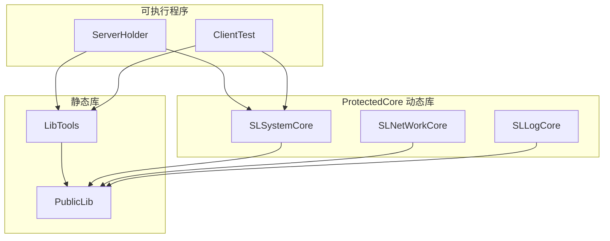
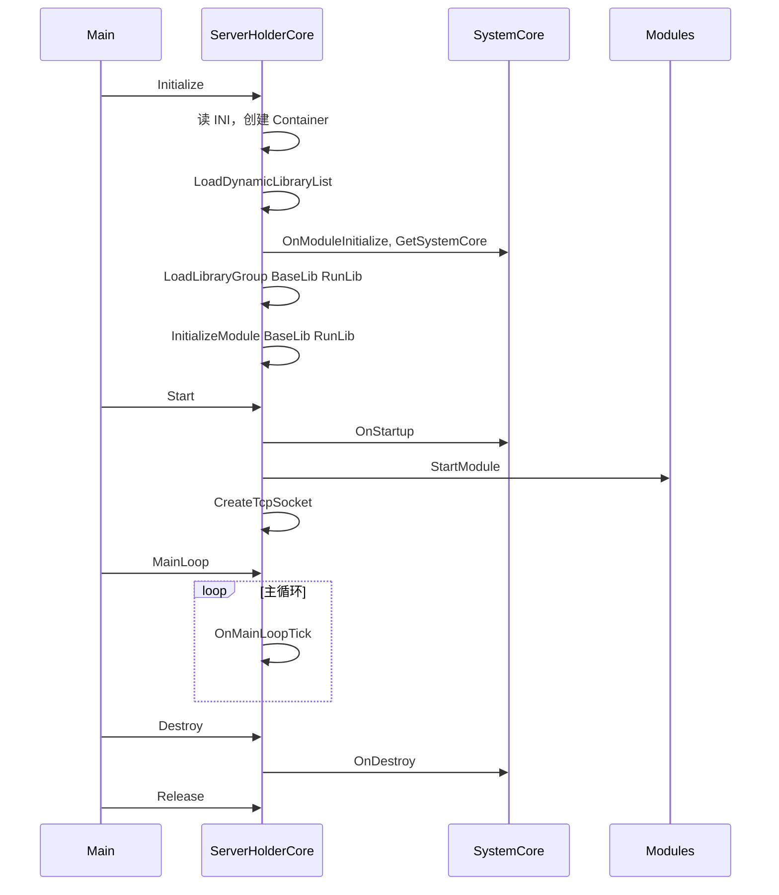

# SLCore 工程设计文档

## 1. 项目概述

### 1.1 项目定位

**SLCore** 是一个 C++ 跨平台服务端核心框架，采用插件化模块架构。主程序（ServerHolder）通过动态库加载系统核心与业务模块，由 INI 配置驱动模块列表与网络监听等行为。

### 1.2 技术栈

- **语言与标准**：C++11
- **构建系统**：CMake（生成 Visual Studio 工程或 Unix Makefiles）
- **平台**：Windows、Linux
- **网络**：Windows 下基于 IOCP（完成端口），Linux 下基于 epoll

### 1.3 构建与运行

- 从仓库根目录进入 `_build`，执行 `cmake` 指向 `SourcePath`（或上层 Server 工程），再 `make -j4`。
- Windows 下使用 `WinBuild/SLCore.sln` 打开解决方案，配置为 Debug|x64。
- 运行前需准备 `../Modules/`（Windows）或 `../Modules/lib/`（Linux）下的动态库及 INI 配置（如 ExecuteAppConfig、ModuleList）。

---

## 2. 系统架构

### 2.1 分层架构

从下至上分为：公共基础库 → 工具库 → 保护核心（动态库）→ 可执行程序。



### 2.2 依赖关系说明

| 层级 | 项目 | 类型 | 依赖 |
|------|------|------|------|
| 底层 | PublicLib | 静态库 | 无（仅系统/标准库） |
| 工具 | LibTools | 静态库 | PublicLib |
| 核心 | SLSystemCore | 动态库 | PublicLib |
| 核心 | SLNetWorkCore | 动态库 | PublicLib |
| 核心 | SLLogCore | 动态库 | PublicLib |
| 可执行 | ServerHolder | 可执行文件 | PublicLib, LibTools；运行时加载各 Core 动态库 |
| 可执行 | ClientTest | 可执行文件（仅 Windows） | PublicLib, LibTools；运行时加载 SystemCore 等 |

ServerHolder 为服务端主程序；ClientTest 为仅 Windows 的客户端测试程序，结构与 ServerHolder 类似但面向测试场景。

---

## 3. 模块与接口设计

### 3.1 CoreInterface 目录

接口头文件集中在 `SourcePath/CoreInterface/`，由 `CoreInterface.cmake` 统一纳入工程：

- `ISystemCore.h` - 系统核心
- `ISystemHelper.h` - 系统辅助（模块注册、当前模块、容器注册）
- `IModuleInterface.h` - 模块生命周期与导出约定
- `IModuleInterfaceContainer.h` - 核心接口容器
- `IModuleCoreInterface.h` - 核心模块接口基类
- `IModuleLogicInterface.h` - 业务逻辑接口（预留）
- `ILogCore.h` - 日志核心
- `INetWorkCore.h` - 网络核心

### 3.2 核心接口说明

#### IModule

- **职责**：所有动态库模块的通用生命周期与身份。
- **主要方法**：
  - `OnModuleInitialize(ISystemCore*)` - 模块初始化并绑定系统核心
  - `OnThreadInitialize()` - 挂入线程后的初始化
  - `OnStartup()` - 启动
  - `OnDestroy()` - 销毁（停线程、释放在线程中的资源）
  - `OnRelease()` - 释放（主线程资源，可 delete this）
  - `Name()` - 模块名
  - `GetSystemCore()` - 获取系统核心

#### ISystemCore

- **职责**：系统核心，统一提供模块、辅助、容器、日志与核心接口注册。
- **主要方法**：
  - `GetModule(const char* strName)` - 按名获取业务模块
  - `GetSystemHelper()` - 系统辅助
  - `GetInterfaceContainer()` - 核心接口容器
  - `GetModuleCoreInterface(const char* strName)` - 按名获取核心接口（如 LogCore、NetWorkCore）
  - `GetLogCore()` - 日志核心
  - `ReginserModuleCoreInterface(name, IModuleCoreInterface*)` - 注册核心接口

#### IModuleInterfaceContainer

- **职责**：按名称管理 IModuleCoreInterface，由宿主（如 ServerHolder）实现，SystemCore 仅持指针。
- **主要方法**：
  - `RegisterCoreInterface(name, IModuleCoreInterface*)`
  - `RemoveCoreInterface(name)`
  - `GetCoreInterface(name)`

实现类：`ServerCoreModuleInterfaceContainer`（ServerHolder）、`ClientCoreModuleInterfaceContainer`（ClientTest）。

#### IModuleCoreInterface

- **职责**：核心能力模块（如 Log、Network）的通用生命周期。
- **主要方法**：`Initialize(IModule*)`、`Startup()`、`Destroy()`、`Release()`
- **派生**：ILogCore、INetWorkCore 的实现类同时实现此接口。

#### ISystemHelper

- **职责**：模块注册与当前模块、接口容器注册。
- **主要方法**：
  - `RegisterModule(name, IModule*)`
  - `SetCurrentModule(IModule*)` / `GetCurrentModule()`
  - `RegisterModuleInterfaceContainer(IModuleInterfaceContainer*)`

#### ILogCore（继承 IModuleCoreInterface）

- **职责**：管理日志线程、按 key 创建/输出日志。
- **主要方法**：
  - `RegisterThread(ThreadBase*, source, logKey)` - 注册线程与日志 key
  - `CreateLog(logKey)`、`OutputLog(logKey, level, fmt, ...)`

#### INetWorkCore

- **职责**：监听/连接 Socket 的创建。
- **主要方法**：
  - `CreateListenSocket(address, port)` / `CreateListenSocket(address)`（"host:port" 形式）
  - `CreateConnectSocket(address, port)` / `CreateConnectSocket(address)`

### 3.3 模块导出约定

- 每个符合规范的动态库需导出：
  - `extern "C" int Module_GetVersion()` - 返回 `CORE_MODULE_VERSION`（当前为 0x20200115）
  - `extern "C" IModule* Module_GetModule()` - 返回该库的 IModule 单例
- 宏：`CREATE_MODULE(ModuleName)` 声明模块类，`INTERFACE_MODULE(ModuleName)` 实现上述两个导出函数。

---

## 4. 服务端启动与运行流程

### 4.1 总体流程

ServerHolder 按顺序执行：**Initialize** → **Start** → **MainLoop**，退出时 **Destroy** → **Release**。



### 4.2 Initialize

- 读取 INI：ExecuteAppConfig、ModuleList。
- 若配置 PauseOn 则暂停（Windows 弹框 / Linux 循环等待 SetPause(false)）。
- 创建 `ServerCoreModuleInterfaceContainer`，并交给 SystemCore 的 SystemHelper（RegisterModuleInterfaceContainer）。
- 加载动态库列表：
  - 先加载 SLSystemCore，校验版本，取 Module_GetModule，执行 OnModuleInitialize，得到 ISystemCore。
  - 再按 ModuleList 的 BaseLib、RunLib 配置加载各模块并加入对应 handle 容器（不在此阶段调用业务模块的 Initialize，由后续 InitializeModule 统一调用）。

### 4.3 Start

- 调用 SystemModule->OnStartup()。
- 对 BaseLib、RunLib 中已加载的模块执行 StartModule（取 Module，执行 OnStartup）。
- CreateTcpSocket：从 ExecuteAppConfig 的 TCPListenAddr 读取 In_Addr、Out_Addr，通过 `GetModuleCoreInterface("SLCNetWorkCore")` 得到 INetWorkCore，依次 CreateListenSocket。

### 4.4 MainLoop

- OnMainLoopInitialize → OnMainLoopStartup（当前为占位）。
- 循环执行 OnMainLoopTick，直到 Destroy 将 m_bLoopEnable 置为 false。

### 4.5 Destroy / Release

- Destroy：置 m_bLoopEnable = false，执行 OnMainLoopDestroy（内部调用 SystemModule->OnDestroy()）。
- Release：OnRelease() 中释放所有模块、关闭所有动态库、销毁 ExecuteIniConfigReader 单例。

---

## 5. 动态库加载与配置

### 5.1 加载路径与命名

- Windows：`./../Modules/`，文件名为 `模块名.dll`。
- Linux：`./../Modules/lib`，文件名为 `模块名.so`。

### 5.2 版本校验

- 加载后先取符号 `Module_GetVersion`，返回值必须等于 `CORE_MODULE_VERSION`（0x20200115），否则拒绝加载。

### 5.3 模块分组与配置

- ModuleList.ini 中配置两类分组：**BaseLib**、**RunLib**，每类下列出模块名，由 `ExecuteIniConfigReader::GetConfigItemList("ModuleList", "BaseLib"|"RunLib", vList)` 读取。
- 加载的 handle 分别存入 m_dicBaseDllHandleMap、m_dicRunDllHandleMap。

### 5.4 配置项摘要

- **ExecuteAppConfig**
  - Start Op / PauseOn：是否启动时暂停。
  - TCPListenAddr：In_Addr、Out_Addr（监听地址，如 "ip:port"）。
- **ModuleList**
  - BaseLib：基础库模块名列表。
  - RunLib：运行库模块名列表。

### 5.5 动态加载 API

- 由 PublicLib 的 FileSystem 提供：
  - `LoadDynamicFile(fileName, errorCode)` - 加载动态库
  - `LoadDynamicFileSymbol(handle, symbolName, errorCode)` - 取符号
  - `CloseDynamicFile(handle, errorCode)` - 关闭动态库
- Windows 实现在 `WindowsFileSystem.cpp`，Linux 在 `LinuxFileSystem.cpp`。

---

## 6. 核心组件

### 6.1 PublicLib

- **Common**：LibThreadBase、LogThreadBase、UnLockQueue、StandardUnLockElement、tools（字符串分割、Trim、CheckStringValid、AutoLock）、Util、TypeDefines、UnLockElementTypeDefine。
- **System**：FileSystem（含动态库加载）、TimeSystem、IniConfigFile、SystemMacros（SYSTEM_HANDLE、DEF_DLL_EXPORT、DEF_MODULE_FILE_EXTRA_NAME）。
- **Windows**：WindowsFileSystem、WindowsTimeSystem。
- **Linux**：LinuxFileSystem、LinuxTimeSystem。

### 6.2 LibTools

- **ExecuteIniConfigReader**：单例，读取 INI 到内存（IniConfigFile），提供 ReadConfig、GetConfigStringValue、GetConfigBoolValue、GetConfigIntValue、GetConfigFloatValue、GetConfigItemList、CheckHaveConfigGroup。

### 6.3 SLSystemCore

- 实现 ISystemCore；内部维护模块 map、SLCSystemHelper、IModuleInterfaceContainer、ILogCore。
- 提供 OnStart、OnInitialize、OnDestroy、OnRelease；通过 Module 宏导出为 SLCSystemCore 模块。

### 6.4 SLLogCore

- 实现 ILogCore；管理日志线程（LogThreadBase）及 UnLockQueueBase 注册队列，支持按 key 的 CreateLog、OutputLog 与 RegisterThread。
- 日志路径宏：SLC_LOG_PATH "../Log/"。

### 6.5 SLNetWorkCore

- 实现 INetWorkCore 与 IModuleCoreInterface。
- Windows：WinICOPManager 管理 ICOPElement，每个 Element 对应 WinCompletionPortListener、WinCompletionPortWorker、WinCompletionPortQueue（基于 IOCP）。
- Linux：使用 epoll（m_dicEpollFD 等）实现监听/连接。
- 对外提供 CreateListenSocket / CreateConnectSocket 多态接口。

---

## 7. 目录与工程结构

### 7.1 源码目录树

```
SourcePath/
├── CMakeLists.txt
├── Common.cmake
├── CoreInterface.cmake
├── ExecuteAble.cmake
├── CoreInterface/
│   ├── ISystemCore.h
│   ├── ISystemHelper.h
│   ├── IModuleInterface.h
│   ├── IModuleInterfaceContainer.h
│   ├── IModuleCoreInterface.h
│   ├── IModuleLogicInterface.h
│   ├── ILogCore.h
│   └── INetWorkCore.h
├── PublicLib/
│   ├── CMakeLists.txt
│   ├── Include/Common/, System/, Windows/, Linux/
│   └── SourceFile/Common/, System/, Windows/, Linux/
├── LibTools/
│   ├── CMakeLists.txt
│   └── ExecuteIniConfigReader.cpp/.h
├── ProtectedCore/
│   ├── SystemCore/
│   ├── NetWorkCore/
│   │   ├── WinNetWork/, WinNetWork/WinCompletionPort/
│   │   ├── LinuxNetWork/
│   │   └── CommonDefine/
│   └── LogCore/
├── ServerHolder/
│   ├── CMakeLists.txt
│   ├── ServerHolder.cpp
│   ├── ServerCore.h/.cpp
│   └── ServerCoreModuleInterfaceContainer.h/.cpp
└── ClientTest/
    ├── CMakeLists.txt
    ├── ClientTest.cpp
    ├── ClientDemoCore.h/.cpp
    └── ClientCoreModuleInterfaceContainer.h/.cpp
```

### 7.2 工程与产物对照

| 项目名 | 类型 | 产出 |
|--------|------|------|
| PublicLib | 静态库 | PublicLib.lib / libPublicLib.a |
| LibTools | 静态库 | LibTools.lib / libLibTools.a |
| SLSystemCore | 动态库 | SLSystemCore.dll / libSLSystemCore.so |
| SLNetWorkCore | 动态库 | SLNetWorkCore.dll / libSLNetWorkCore.so |
| SLLogCore | 动态库 | SLLogCore.dll / libSLLogCore.so |
| ServerHolder | 可执行文件 | ServerHolder.exe / ServerHolder |
| ClientTest | 可执行文件（仅 Windows） | ClientTest.exe |

---

## 8. 附录

### 8.1 接口与实现类对照

| 接口 | 实现类 | 所在项目 |
|------|--------|----------|
| ISystemCore | SLC_SystemCore | ProtectedCore/SystemCore |
| ISystemHelper | SLCSystemHelper | ProtectedCore/SystemCore |
| IModuleInterfaceContainer | ServerCoreModuleInterfaceContainer | ServerHolder |
| IModuleInterfaceContainer | ClientCoreModuleInterfaceContainer | ClientTest |
| ILogCore | SLC_LogCore | ProtectedCore/LogCore |
| INetWorkCore | SL_NetWorkCore | ProtectedCore/NetWorkCore |

### 8.2 第三方与仓库内子项目

- **Probuf**：仓库内 Protocol Buffers 相关源码（third_party 等），当前 SourcePath 未直接引用，可作协议或后续扩展预留。
- **Lua**：仓库内 Lua 源码，当前 SourcePath 未直接引用，可作脚本扩展预留。

---

*文档版本与代码对应：基于当前 SLCore 仓库解析生成。*
